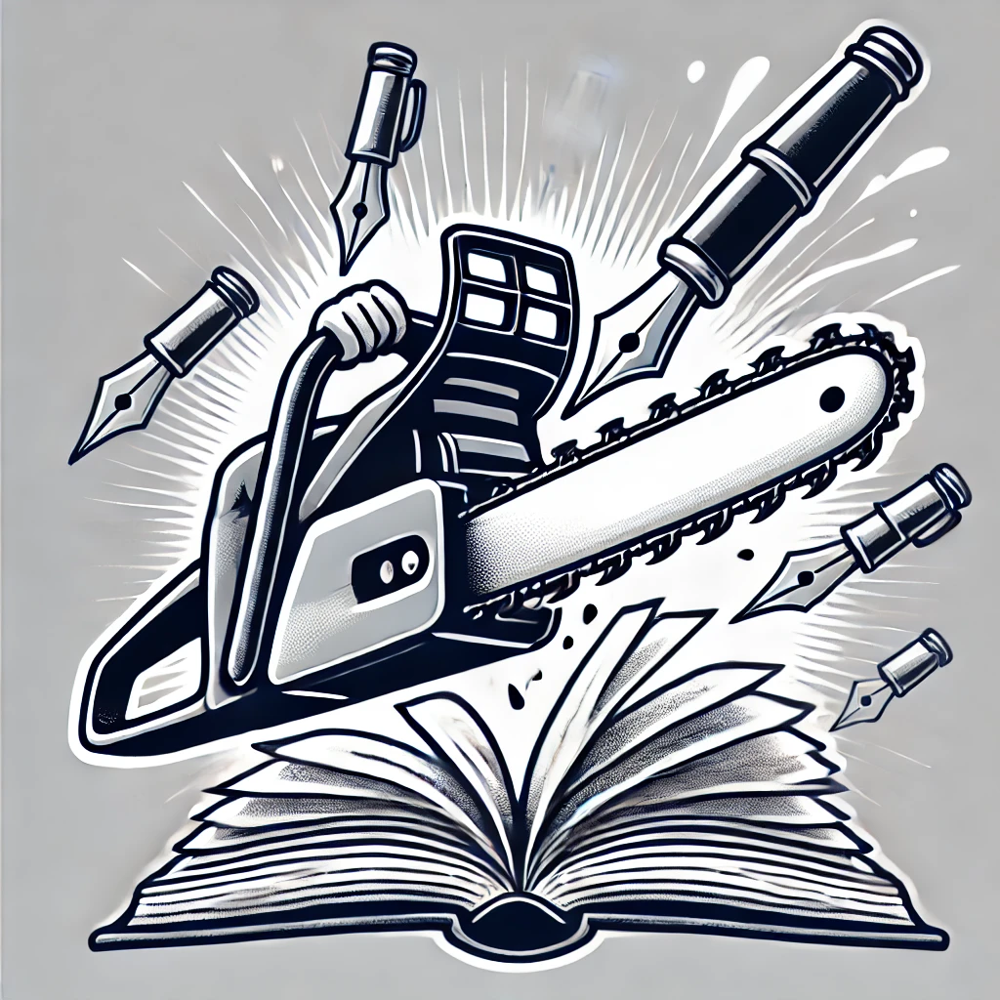

# Literate Chainsaw

This used to be a QR Maker idea, now it's for an application made in Go
for the purpose of creating writing prompts and keeping tabs on words
per session.

It is part of a personal goal to learn Go and pick up on writing.
